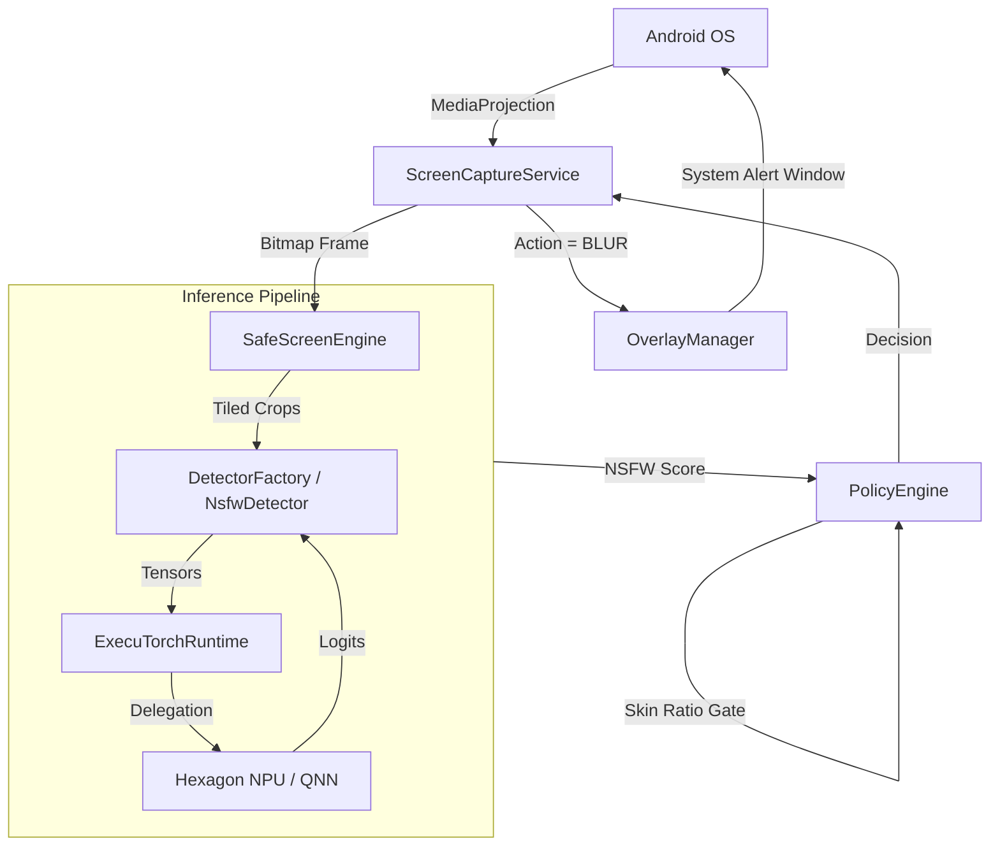
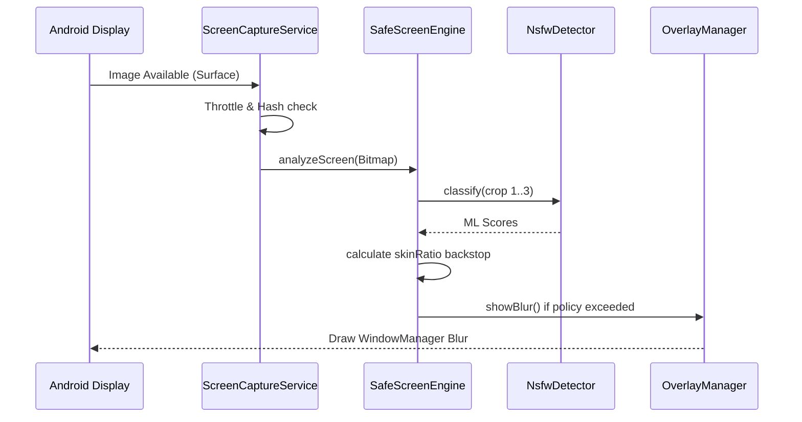
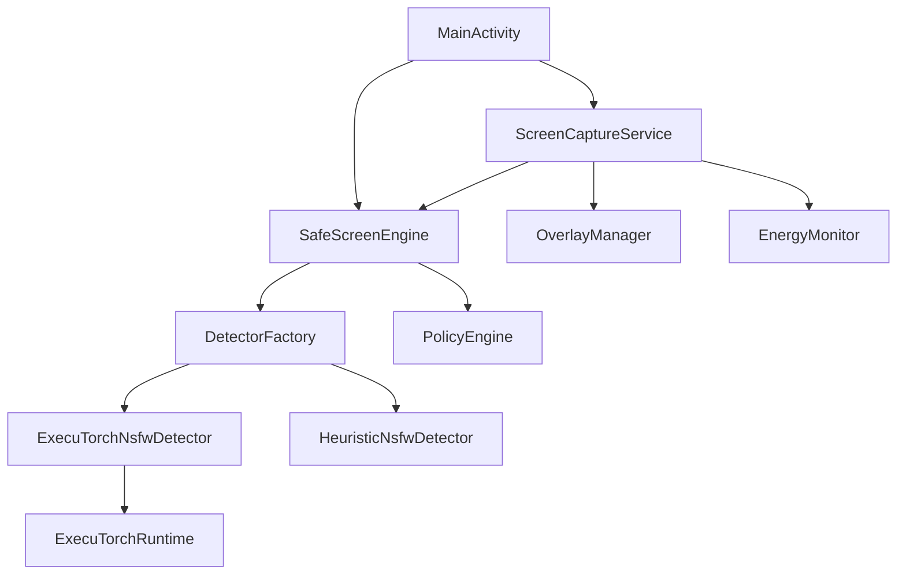
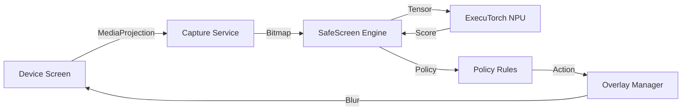

# System Architecture

## 1. Executive Summary

SafeScreen AI is an on-device visual safety layer for Android. It operates as a background service that continuously captures the device's screen using `MediaProjection`, processes the frames through an on-device Machine Learning pipeline (via ExecuTorch) to detect NSFW (explicit) content, and applies a system-wide draw-over-apps blur overlay if explicit content is detected. The entire architecture is designed around strict privacy (no network access) and low-latency inference using the Snapdragon Hexagon NPU.

## 2. Technology Stack

### Languages
* **Kotlin**: Primary language for the Android application.
* **Python**: Used exclusively in the `tools/` directory for model conversion, quantization, and export.

### Frameworks
* **Android SDK**: Core platform for foreground services and screen capture.
* **Jetpack Compose**: Used for the UI (Settings, HUD, In-App test feed).
* **ExecuTorch (0.6.0)**: On-device ML inference engine bridging PyTorch models to mobile.

### Libraries & Infrastructure
* **Qualcomm AI Engine Direct (QNN)**: The backend delegate used by ExecuTorch to run quantized int8 models directly on the Hexagon DSP (NPU) for maximum efficiency.
* **XNNPACK**: Fallback CPU backend for ExecuTorch if QNN/NPU is unavailable.
* **Kotlin Coroutines**: For asynchronous execution and thread management during inference.

## 3. Repository Structure

```text
Repository
├── app/
│   ├── src/main/java/ai/safescreen/    # Android application source
│   ├── build.gradle.kts                # Android build configuration
│   └── ...
├── tools/
│   ├── export_qnn.py                   # Python script for QNN/NPU model export
│   ├── export_xnnpack.py               # Python script for CPU model export
│   └── ...
├── docs/                               # Extensive project documentation
└── README.md                           # Main project overview
```

## 4. High-Level Architecture



## 5. Application Entry Points

1. **`MainActivity.kt`**
    * **Initialization**: Requests necessary permissions (Overlay, Notifications, Screen Capture).
    * **Router/Controller**: Launches Jetpack Compose UI (`HomeScreen` or `InAppFeedScreen`).
    * **Service**: Can trigger the `ScreenCaptureService` via Intent.

2. **`ScreenCaptureService.kt`**
    * **Initialization**: Started as a Foreground Service (`mediaProjection` type).
    * **Router**: Registers `MediaProjection.Callback` and creates a `VirtualDisplay` to read the screen.
    * **Service**: `ImageReader.OnImageAvailableListener` is the core loop pushing frames into the `SafeScreenEngine`.

## 6. Component Architecture

### SafeScreenEngine
* **Location**: `app/src/main/java/ai/safescreen/SafeScreenEngine.kt`
* **Responsibility**: Orchestrates the analysis of bitmaps. Handles tiling (cropping non-square frames into squares) and integrates the ML score with a heuristic skin-ratio backstop to reduce false positives.
* **Dependencies**: `DetectorFactory`, `PolicyEngine`.

### NsfwDetector (ExecuTorchNsfwDetector)
* **Location**: `app/src/main/java/ai/safescreen/pipeline/Detector.kt`
* **Responsibility**: Wraps the ExecuTorch runtime to execute the ML model. Preprocesses bitmaps to tensors, runs inference, and converts output logits to a probability score.
* **Fallback**: Degrades to `HeuristicNsfwDetector` (skin-ratio only) if the model `.pte` file is missing or crashes.

### PolicyEngine
* **Location**: `app/src/main/java/ai/safescreen/policy/PolicyEngine.kt`
* **Responsibility**: Translates continuous NSFW probability scores into discrete actions (SHOW, BLUR_REVEAL, BLOCK) based on configured thresholds.

### OverlayManager
* **Location**: `app/src/main/java/ai/safescreen/capture/OverlayManager.kt`
* **Responsibility**: Manages the system-wide `WindowManager` draw-over-apps views. Displays the full-screen blur and the control panel.
* **Processing**: Uses `RenderEffect.createBlurEffect()` for native, low-latency blurring. Implements a cooldown mechanism to prevent re-blurring immediately after a user taps "Reveal".

## 7. Directory Architecture

| Directory                 | Responsibility                                  | Important Files                               |
| ------------------------- | ----------------------------------------------- | --------------------------------------------- |
| `ai/safescreen/bench/`    | Hardware benchmarking and power profiling       | `PowerMeter.kt`, `Benchmark.kt`               |
| `ai/safescreen/capture/`  | OS integration for screen reading and drawing   | `ScreenCaptureService.kt`, `OverlayManager.kt`|
| `ai/safescreen/pipeline/` | ML inference and data preparation               | `Detector.kt`, `ModelRuntime.kt`              |
| `ai/safescreen/policy/`   | Decision logic and thresholds                   | `PolicyEngine.kt`, `TemporalSmoother.kt`      |
| `ai/safescreen/feed/`     | Internal UI for testing without screen capture  | `InAppFeedScreen.kt`                          |
| `ai/safescreen/ui/`       | Compose UI components                           | `SettingsPanel.kt`, `TelemetryHud.kt`         |

## 8. Data Flow

### Live Screen Monitoring Flow
1. **Source**: Android `MediaProjection` writes RGBA frames to an `ImageReader` surface.
2. **Throttle**: `ScreenCaptureService` throttles processing (default ~80ms) to conserve energy.
3. **Hashing**: `ScreenCaptureService.frameHash()` computes a perceptual hash of the frame's center to detect if the user has navigated away from a revealed image.
4. **Engine**: `SafeScreenEngine.analyzeScreen()` splits the frame into 3 square crops.
5. **Inference**: Each crop is passed to `ExecuTorchNsfwDetector.classify()`.
6. **Skin Gate**: `SafeScreenEngine` computes a `skinRatio` for each crop. If the ML model is highly confident, it acts alone. Otherwise, it requires skin-pixel corroboration to prevent false positives on UI elements.
7. **Policy**: The max score across crops is passed to `PolicyEngine.decide()`.
8. **Intervention**: If `Severity >= MEDIUM`, `OverlayManager.showBlur()` is called, drawing a blurred `ImageView` over the screen.

## 9. Feature Flows

## Feature: Screen Protection

### Trigger
User clicks "Start protection" -> grants MediaProjection permission -> Foreground service starts.

### Execution Flow


### Relevant Files
* `src/main/java/ai/safescreen/capture/ScreenCaptureService.kt`
* `src/main/java/ai/safescreen/SafeScreenEngine.kt`
* `src/main/java/ai/safescreen/capture/OverlayManager.kt`

## 10. API Architecture

Not applicable — no network APIs are implemented. The app operates 100% offline.

## 11. Database & Storage Architecture

Not applicable — no databases or persistent storage are implemented. The application processes frames completely in memory and actively discards them to guarantee privacy.

## 12. Authentication & Authorization

Not applicable — no authentication is implemented.

## 13. External Services

Not applicable — the application deliberately declares no `INTERNET` permission in its `AndroidManifest.xml` (`<uses-permission android:name="android.permission.INTERNET" />` is absent).

## 14. AI / ML Architecture

### Models
* **NSFW Classifier**: MobileNetV4 (conv-small) or Marqo ViT-tiny (384px).
* **Deepfake Detector**: Mentioned in documentation (`export_qnn.py`, `export_xnnpack.py`) but *inference is not currently wired into the Kotlin `SafeScreenEngine` pipeline*.

### Processing Flow
1. **Export/Quantization** (`tools/export_qnn.py`):
    * PT2E Post-Training Quantization (PTQ) converts the model to int8 (8a8w).
    * Uses *per-channel symmetric weights* to preserve accuracy on depthwise convolutions.
    * Lowers the graph to QNN for a specific Hexagon architecture (e.g., SM8750 for Snapdragon 8 Elite).
2. **Runtime Loading** (`ModelRuntime.kt`):
    * The app loads native library `qnn_executorch_backend` and configures DSP paths (`ADSP_LIBRARY_PATH`).
    * The `.pte` model is loaded from assets or external storage override.
3. **Inference** (`Detector.kt`):
    * `Preprocessor` resizes and normalizes the bitmap using ImageNet Mean/Std.
    * Data is passed as a flat `FloatArray` to the ExecuTorch `Module`.
    * Output logits are converted to a probability score.

## 15. Event & Async Architecture

* **HandlerThread**: `ScreenCaptureService` uses a dedicated `HandlerThread` (`"ss-capture"`) to receive frames from `ImageReader`. This prevents the OS UI thread from blocking.
* **Coroutines**: `SafeScreenEngine` confines all ML inference to a single-threaded coroutine dispatcher (`Executors.newSingleThreadExecutor { ... }.asCoroutineDispatcher()`).
    * **Why**: The native ExecuTorch `Module` is not thread-safe. Concurrent forward passes will corrupt the heap.

## 16. State Management

* **Jetpack Compose State**: `MainActivity` and `InAppFeedScreen` use standard Compose `mutableStateOf` to reactively update the UI (e.g., telemetry HUD, benchmark results, settings panels).
* **Service State**: `ScreenCaptureService` uses basic volatile variables to track state (`busy`, `lastProcMs`, `lastBlurMs`).

## 17. Error Handling

* **Model Load Failures**: If ExecuTorch fails to load the `.pte` file or the QNN backend fails to initialize (e.g., missing DSP libraries), `ModelRuntime.tryLoad()` safely returns `null`.
* **Inference Fallback**: `DetectorFactory` checks for a valid runtime. If absent, it gracefully falls back to `HeuristicNsfwDetector` (a purely algorithmic skin-tone pixel counter) so the app continues to function as a demo.
* **Inference Crashes**: The `ExecuTorchNsfwDetector.classify()` wraps the forward pass in a `try/catch`. If it throws, it flags itself as `degraded` and permanently routes subsequent frames to the fallback heuristic to prevent crash loops.

## 18. Security Architecture

* **Zero Exfiltration (Privacy by Construction)**: The app lacks the `INTERNET` permission. By OS definition, it cannot exfiltrate captured frames.
* **Overlay Pass-through**: The full-screen blur `WindowManager` view uses `FLAG_NOT_TOUCHABLE`, meaning the user can safely use Android navigation gestures (back, home) to escape the underlying explicit content without interacting with it.
* **Memory Management**: Bitmaps created for analysis are aggressively `.recycle()`'d in `SafeScreenEngine.analyzeScreen()` to prevent leaking sensitive frames in memory.

## 19. Configuration

* **ModelConfig**: Hardcoded configurations in `ModelConfig.kt` dictate tensor shapes (`inputSize`), normalization (`mean`/`std`), and target output indices for different models (`NSFW`, `NSFW_MARQO`, `NSFW_MARQO_QNN`).
* **Thresholds**: Tunable parameters in `Thresholds` (e.g., `nsfwBlur`, `skinMin`) adjust the strictness of the Policy Engine.

## 20. Build & Deployment

* **Build Tool**: Gradle (`build.gradle.kts`).
* **Ndk/Abis**: Filtered to `arm64-v8a` only to drastically shrink APK size and speed up local deployments.
* **Assets**: Models (`.pte`) are bundled in `assets/models/`. `androidResources.noCompress += "pte"` ensures ExecuTorch can memory-map them directly without extraction overhead.
* **Developer Overrides**: `ModelRuntime.tryLoad()` checks `/sdcard/Android/data/ai.safescreen/files/models/` for pushed `.pte` files before falling back to assets, enabling fast iteration via `adb push` without recompiling the APK.

## 21. Testing Architecture

* **Standard Tests**: Not applicable (no `test/` or `androidTest/` directories found).
* **On-Device Benchmarking**: `PowerMeter.kt` and `Benchmark.kt` provide a built-in suite that runs the inference pipeline 100 times, measuring P50 latency, throughput (fps), and polling the Android `BatteryManager` to estimate whole-device power consumption (mW) and energy per inference (mJ).

## 22. Design Patterns

* **Singleton**: `SafeScreenEngine.get(Context)` ensures only one instance of the ML models is loaded into memory.
* **Strategy**: `NsfwDetector` interface allows swapping between `ExecuTorchNsfwDetector` and `HeuristicNsfwDetector`.
* **Factory**: `DetectorFactory.create()` handles the complex logic of resolving the best available ML backend (QNN vs XNNPACK vs Heuristic).

## 23. Dependency Graph



## 24. Complete Execution Trace

**User opens a blocked image on Twitter**:
1. Twitter renders an explicit image.
2. OS pushes the composite screen frame to `VirtualDisplay`.
3. `ImageReader` triggers `onImageAvailable` callback on `"ss-capture"` background thread.
4. `ScreenCaptureService` converts `Image` to `Bitmap` (`imageToBitmap`).
5. `ScreenCaptureService` checks `frameHash()` to ensure it hasn't been explicitly "revealed" by the user.
6. `SafeScreenEngine.analyzeScreen(bitmap)` executes on `inferenceDispatcher`.
7. Bitmap is split into 3 square crops (`squareCrops`).
8. `ExecuTorchNsfwDetector` normalizes the crop to a tensor and executes `module.forward()`.
9. The NPU returns logits; `scoreOf()` converts to a probability (e.g., `0.92`).
10. `SafeScreenEngine` computes `skinRatio` (e.g., `0.45`).
11. Signal is strong enough; max score across crops is passed to `PolicyEngine`.
12. `PolicyEngine.decide()` returns `Action.BLOCK`.
13. `ScreenCaptureService` commands `OverlayManager.showBlur()`.
14. `OverlayManager` posts to Main Looper to inject the `RenderEffect` blur into the `WindowManager`.
15. User sees a blurred screen and a control panel.

## 25. Architecture Decisions

* **Decision**: Per-Channel Int8 Quantization.
  * **Evidence**: `tools/export_qnn.py` sets `QuantDtype.use_8a8w`.
  * **Reason**: Documented in Python comments: per-tensor quantization destroys accuracy on depthwise-separable convolutions (like MobileNet).
* **Decision**: Skin-Ratio Backstop.
  * **Evidence**: `SafeScreenEngine.analyzeScreen` modifies ML scores based on `skinRatio()`.
  * **Reason**: Prevents catastrophic false positives on UI chrome. The ML models (especially quantized to int8) occasionally hallucinate on flat UI elements. Since explicit imagery implies nudity (skin), the absence of skin vetoes borderline ML scores.
* **Decision**: Tiled Square Crops.
  * **Evidence**: `SafeScreenEngine.squareCrops()`.
  * **Reason**: The ML models expect square inputs (224x224 or 384x384). Squashing a 20:9 phone screen into a square distorts the aspect ratio severely. Cropping into 3 vertical squares preserves aspect ratio and allows localization.

## 26. Bottlenecks & Risks

* **Problem**: ExecuTorch Thread Safety.
  * **Location**: `ExecuTorchRuntime.kt`, `SafeScreenEngine.kt`.
  * **Risk**: The native `Module.forward()` is not thread-safe. A developer mistake routing multiple coroutines into the engine concurrently will cause JVM crashes. Currently mitigated by `inferenceDispatcher` (SingleThreadExecutor), but creates a throughput bottleneck.
* **Problem**: BatteryManager Power Estimates.
  * **Location**: `PowerMeter.kt`.
  * **Risk**: `BatteryManager.BATTERY_PROPERTY_CURRENT_NOW` is highly unreliable across OEMs (Samsung often flips signs or uses mA instead of µA). The `PowerMeter` attempts auto-calibration, but the energy benchmark is fundamentally an estimation, not an isolated NPU measurement.
* **Problem**: Unimplemented Deepfake Detector.
  * **Location**: `Detector.kt`.
  * **Risk**: High reliance on deepfake features in the `README` and documentation, but the actual Kotlin codebase has no active `DeepfakeDetector` wired into `SafeScreenEngine`.

## 27. System Summary

SafeScreen AI is a localized, privacy-first screen monitoring application for Android. It operates by utilizing Android's `MediaProjection` API within a foreground service to silently capture device frames at ~12 fps. These frames are routed into a Kotlin-based inference pipeline powered by ExecuTorch, heavily optimized to delegate workloads to the Qualcomm Hexagon NPU via the QNN backend for millisecond latency. 

To ensure robust results, the architecture supplements the AI model with a deterministic algorithmic backstop (skin-tone pixel counting) and applies a temporal policy engine to dictate when to intervene. When explicit content is recognized, the system triggers Android's `WindowManager` to render a native blur effect over the entire screen, blocking engagement until the user interacts with the UI. The repository completely avoids network configurations, relying on ahead-of-time quantized model compilation (via Python tooling) to ensure 100% of the logic executes securely on-device.

### Architecture in One Diagram



### Core Components
| Component | Responsibility |
|-----------|----------------|
| `ScreenCaptureService` | Continuous background screen grabbing |
| `SafeScreenEngine` | Orchestrates cropping, ML, and heuristics |
| `DetectorFactory` | Loads hardware-optimized ML models |
| `OverlayManager` | Renders the system-wide intervention UI |

### Core Data Flows
* **Frame Capture**: `ImageReader` -> `Bitmap`
* **Inference Prep**: `Bitmap` -> `squareCrops` -> `FloatArray`
* **Execution**: `ExecuTorch.forward()` -> `Logits` -> `Probability`
* **Enforcement**: `Probability` + `SkinRatio` -> `Action` -> `WindowManager Blur`

### External Dependencies
| Dependency | Purpose |
|------------|---------|
| `ExecuTorch` | On-device PyTorch model runner |
| `Qualcomm QNN` | Hexagon DSP (NPU) delegate for ExecuTorch |
| `XNNPACK` | CPU fallback delegate |

### Key Architectural Characteristics
* **Privacy-by-Construction**: Complete absence of network connectivity.
* **Hardware-Accelerated**: Relies on int8 quantization for the Snapdragon NPU.
* **Asynchronous**: Non-blocking `ImageReader` surfaces and dedicated coroutine dispatchers.

## 28. Source References

* **Entry Point**: `app/src/main/java/ai/safescreen/MainActivity.kt`
* **Background Capture**: `app/src/main/java/ai/safescreen/capture/ScreenCaptureService.kt`
* **Orchestration**: `app/src/main/java/ai/safescreen/SafeScreenEngine.kt`
* **ML Execution**: `app/src/main/java/ai/safescreen/pipeline/Detector.kt` and `app/src/main/java/ai/safescreen/pipeline/ModelRuntime.kt`
* **UI Intervention**: `app/src/main/java/ai/safescreen/capture/OverlayManager.kt`
* **Model Configurations**: `app/src/main/java/ai/safescreen/pipeline/ModelConfig.kt`
* **Python Exporter**: `tools/export_qnn.py`
