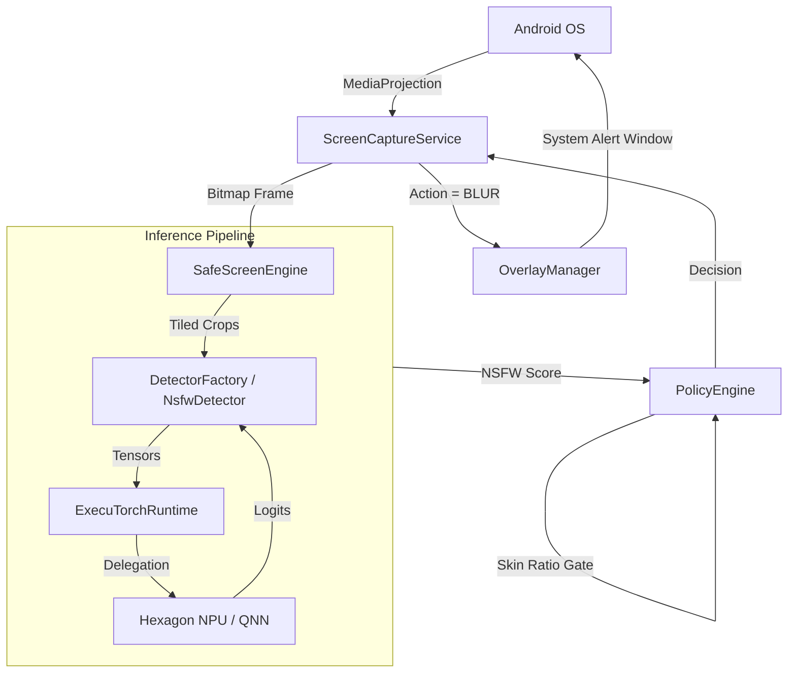
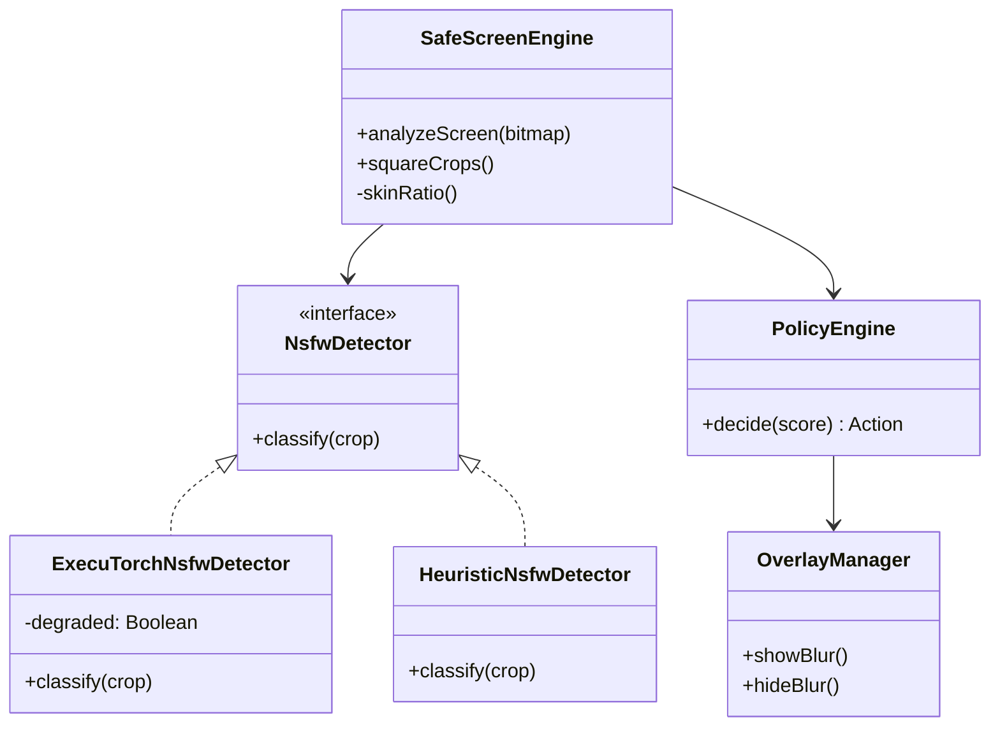
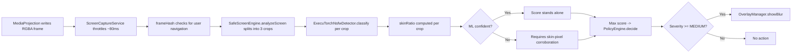
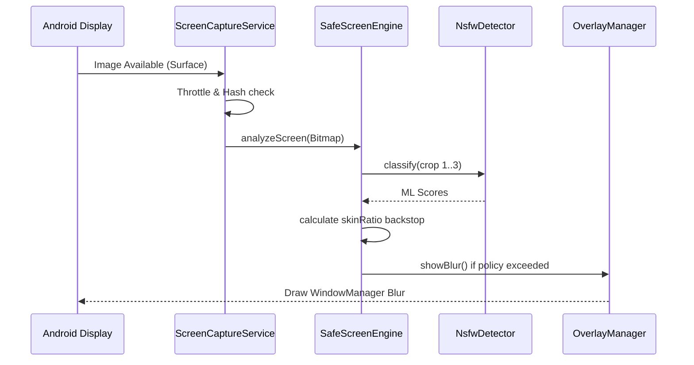
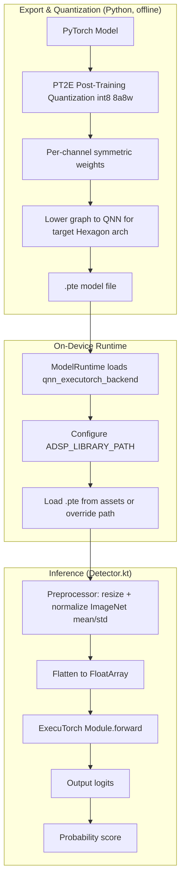
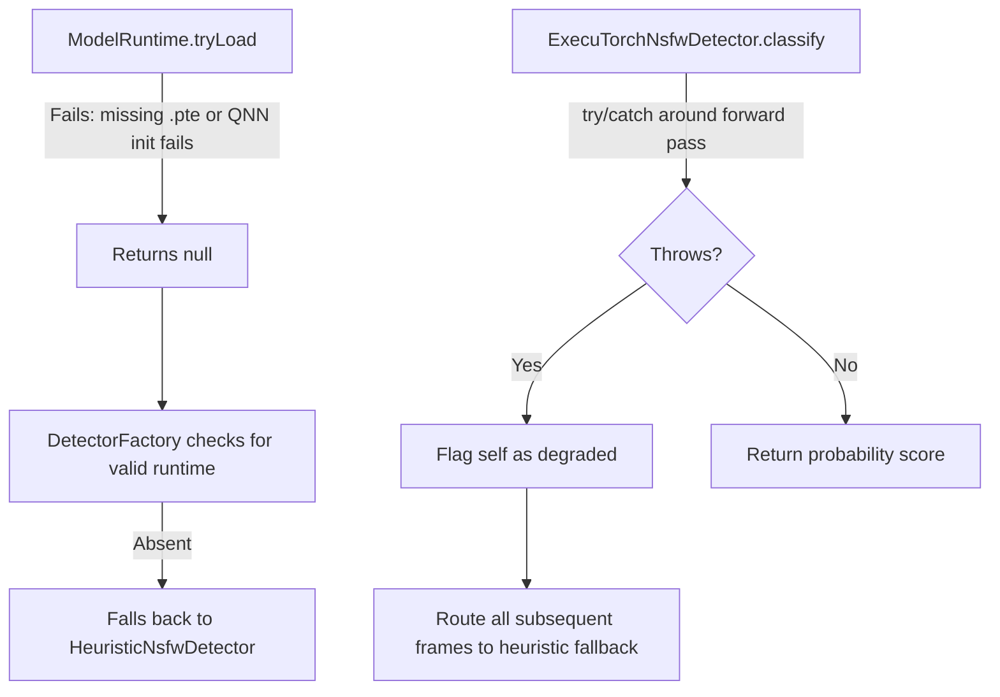
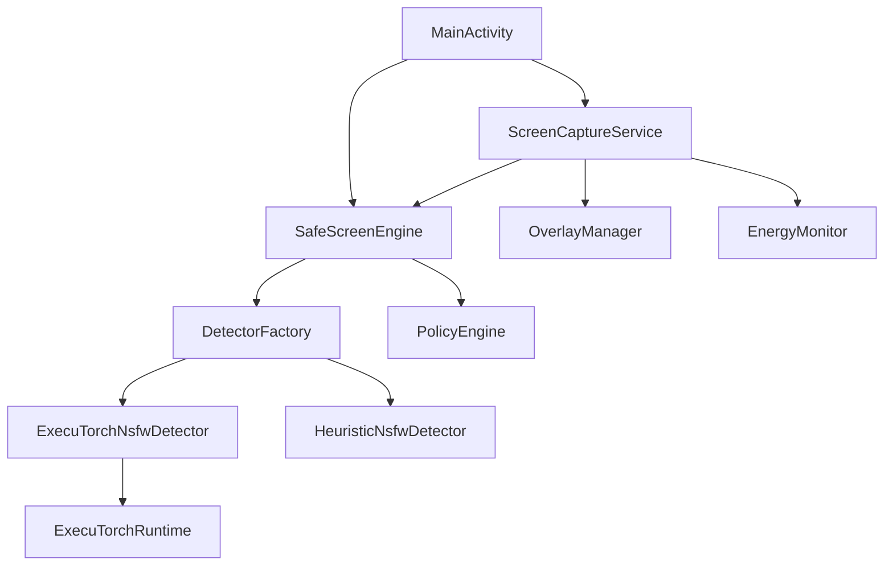
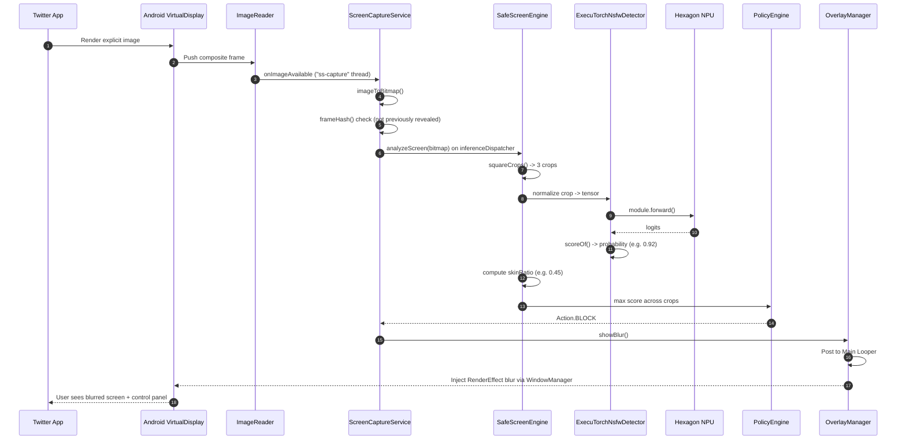

# SafeScreen AI — System Architecture

## 1. Executive Summary

SafeScreen AI is an on-device visual safety layer for Android. It runs as a background service that continuously captures the device screen via `MediaProjection`, processes frames through an on-device ML pipeline (ExecuTorch) to detect explicit content, and applies a system-wide blur overlay when such content is detected. The design is built around two core constraints:

- **Strict privacy** — no network access anywhere in the app.
- **Low latency** — inference is delegated to the Snapdragon Hexagon NPU.

---

## 2. Technology Stack

| Layer | Choice | Notes |
|---|---|---|
| App language | Kotlin | Primary Android app language |
| Tooling language | Python | `tools/` only — model conversion, quantization, export |
| UI framework | Jetpack Compose | Settings, HUD, in-app test feed |
| Inference engine | ExecuTorch 0.6.0 | Bridges PyTorch models to mobile |
| NPU backend | Qualcomm QNN | Runs quantized int8 models on Hexagon DSP |
| CPU fallback | XNNPACK | Used if QNN/NPU unavailable |
| Concurrency | Kotlin Coroutines | Async execution & thread confinement |

---

## 3. Repository Structure

```text
Repository
├── app/
│   ├── src/main/java/ai/safescreen/    # Android application source
│   ├── build.gradle.kts                # Android build configuration
│   └── ...
├── tools/
│   ├── export_qnn.py                   # QNN/NPU model export
│   ├── export_xnnpack.py               # CPU model export
│   └── ...
├── docs/                               # Project documentation
└── README.md
```

---

## 4. High-Level Architecture



---

## 5. Application Entry Points

### `MainActivity.kt`
- **Initialization** — requests permissions (Overlay, Notifications, Screen Capture).
- **Router/Controller** — launches Compose UI (`HomeScreen`, `InAppFeedScreen`).
- **Service trigger** — starts `ScreenCaptureService` via Intent.

### `ScreenCaptureService.kt`
- **Initialization** — runs as a Foreground Service (`mediaProjection` type).
- **Router** — registers `MediaProjection.Callback`, creates `VirtualDisplay`.
- **Core loop** — `ImageReader.OnImageAvailableListener` feeds frames into `SafeScreenEngine`.

---

## 6. Component Architecture (Modules)

### 6.1 `SafeScreenEngine`
- **Path**: `app/src/main/java/ai/safescreen/SafeScreenEngine.kt`
- **Responsibility**: Orchestrates bitmap analysis — tiling non-square frames into squares, combining the ML score with a skin-ratio heuristic backstop.
- **Depends on**: `DetectorFactory`, `PolicyEngine`

### 6.2 `NsfwDetector` (`ExecuTorchNsfwDetector`)
- **Path**: `app/src/main/java/ai/safescreen/pipeline/Detector.kt`
- **Responsibility**: Wraps the ExecuTorch runtime — preprocesses bitmaps to tensors, runs inference, converts logits to a probability score.
- **Fallback**: Degrades to `HeuristicNsfwDetector` (skin-ratio only) if the `.pte` model is missing or crashes.

### 6.3 `PolicyEngine`
- **Path**: `app/src/main/java/ai/safescreen/policy/PolicyEngine.kt`
- **Responsibility**: Converts continuous NSFW probability scores into discrete actions (`SHOW`, `BLUR_REVEAL`, `BLOCK`) based on configured thresholds.

### 6.4 `OverlayManager`
- **Path**: `app/src/main/java/ai/safescreen/capture/OverlayManager.kt`
- **Responsibility**: Manages the system-wide `WindowManager` draw-over-apps views — full-screen blur + control panel.
- **Processing**: Uses `RenderEffect.createBlurEffect()`; includes a cooldown to avoid instant re-blur after "Reveal".



---

## 7. Directory Architecture

| Directory | Responsibility | Important Files |
|---|---|---|
| `ai/safescreen/bench/` | Hardware benchmarking & power profiling | `PowerMeter.kt`, `Benchmark.kt` |
| `ai/safescreen/capture/` | OS integration for screen reading and drawing | `ScreenCaptureService.kt`, `OverlayManager.kt` |
| `ai/safescreen/pipeline/` | ML inference & data preparation | `Detector.kt`, `ModelRuntime.kt` |
| `ai/safescreen/policy/` | Decision logic & thresholds | `PolicyEngine.kt`, `TemporalSmoother.kt` |
| `ai/safescreen/feed/` | Internal UI for testing without screen capture | `InAppFeedScreen.kt` |
| `ai/safescreen/ui/` | Compose UI components | `SettingsPanel.kt`, `TelemetryHud.kt` |

---

## 8. Data Flow



**Steps**
1. **Source**: `MediaProjection` writes RGBA frames to an `ImageReader` surface.
2. **Throttle**: frame processing throttled (~80ms default) to conserve energy.
3. **Hashing**: `frameHash()` detects if the user navigated away from a revealed image.
4. **Engine**: `analyzeScreen()` splits the frame into 3 square crops.
5. **Inference**: each crop passed to `ExecuTorchNsfwDetector.classify()`.
6. **Skin Gate**: skin-ratio backstop corroborates uncertain ML scores.
7. **Policy**: max score across crops sent to `PolicyEngine.decide()`.
8. **Intervention**: if `Severity >= MEDIUM`, `OverlayManager.showBlur()` draws the blurred overlay.

---

## 9. Feature Flow — Screen Protection

**Trigger**: User taps "Start protection" → grants `MediaProjection` permission → foreground service starts.



**Relevant files**
- `capture/ScreenCaptureService.kt`
- `SafeScreenEngine.kt`
- `capture/OverlayManager.kt`

---

## 10–13. API, Storage, Auth, External Services

| Concern | Status |
|---|---|
| **API Architecture** | Not applicable — no network APIs. |
| **Database & Storage** | Not applicable — frames processed in-memory and discarded. |
| **Authentication** | Not applicable — no auth implemented. |
| **External Services** | Not applicable — `INTERNET` permission is deliberately absent from `AndroidManifest.xml`. |

---

## 14. AI / ML Architecture

### Models
- **NSFW Classifier**: MobileNetV4 (conv-small) or Marqo ViT-tiny (384px).
- **Deepfake Detector**: referenced in docs/export scripts but **not wired into** the Kotlin `SafeScreenEngine` pipeline.



---

## 15. Event & Async Architecture

| Mechanism | Purpose |
|---|---|
| `HandlerThread` (`"ss-capture"`) | Receives frames from `ImageReader` without blocking the OS UI thread |
| Single-threaded coroutine dispatcher | Confines all ML inference — required because the native ExecuTorch `Module` is **not thread-safe**; concurrent forward passes corrupt the heap |

---

## 16. State Management

- **UI state**: `MainActivity` / `InAppFeedScreen` use Compose `mutableStateOf` (telemetry HUD, benchmark results, settings).
- **Service state**: `ScreenCaptureService` uses volatile variables (`busy`, `lastProcMs`, `lastBlurMs`).

---

## 17. Error Handling



- **Model load failures** → safe `null` return, no crash.
- **Inference fallback** → `HeuristicNsfwDetector` (pure skin-tone pixel counter) keeps the app functional as a demo.
- **Inference crashes** → self-flags as `degraded`, permanently routes to fallback to prevent crash loops.

---

## 18. Security Architecture

| Control | Mechanism |
|---|---|
| Zero exfiltration | No `INTERNET` permission — OS-level guarantee frames can't leave the device |
| Overlay pass-through | Blur `WindowManager` view uses `FLAG_NOT_TOUCHABLE`, letting the user navigate away (back/home) without interacting with underlying content |
| Memory hygiene | Analysis bitmaps are aggressively `.recycle()`'d in `SafeScreenEngine.analyzeScreen()` |

---

## 19. Configuration

- **`ModelConfig.kt`**: tensor shapes (`inputSize`), normalization (`mean`/`std`), output indices per model variant (`NSFW`, `NSFW_MARQO`, `NSFW_MARQO_QNN`).
- **`Thresholds`**: tunable strictness parameters (`nsfwBlur`, `skinMin`) for the Policy Engine.

---

## 20. Build & Deployment

| Aspect | Detail |
|---|---|
| Build tool | Gradle (`build.gradle.kts`) |
| ABI filter | `arm64-v8a` only — smaller APK, faster local deploys |
| Model assets | Bundled in `assets/models/`; `noCompress += "pte"` enables direct memory-mapping |
| Dev overrides | `ModelRuntime.tryLoad()` checks `/sdcard/Android/data/ai.safescreen/files/models/` before falling back to bundled assets — enables `adb push` iteration without recompiling |

---

## 21. Testing Architecture

- **Unit/instrumented tests**: none present (no `test/` or `androidTest/` directories).
- **On-device benchmarking**: `PowerMeter.kt` + `Benchmark.kt` run inference 100x, measuring P50 latency, throughput (fps), and estimated power draw (mW) / energy per inference (mJ) via `BatteryManager`.

---

## 22. Design Patterns

| Pattern | Where | Purpose |
|---|---|---|
| Singleton | `SafeScreenEngine.get(Context)` | Ensures only one ML model instance is loaded |
| Strategy | `NsfwDetector` interface | Swaps `ExecuTorchNsfwDetector` ↔ `HeuristicNsfwDetector` |
| Factory | `DetectorFactory.create()` | Resolves the best available backend (QNN vs XNNPACK vs Heuristic) |

---

## 23. Dependency Graph



---

## 24. Complete Execution Trace — "User opens a blocked image on Twitter"



---

## 25. Architecture Decisions

| Decision | Evidence | Reason |
|---|---|---|
| Per-channel int8 quantization | `export_qnn.py` sets `QuantDtype.use_8a8w` | Per-tensor quantization destroys accuracy on depthwise-separable convolutions (MobileNet-style) |
| Skin-ratio backstop | `SafeScreenEngine.analyzeScreen` adjusts ML scores via `skinRatio()` | Prevents false positives on UI chrome; int8-quantized models occasionally hallucinate on flat UI elements — absence of skin vetoes borderline scores |
| Tiled square crops | `SafeScreenEngine.squareCrops()` | Models expect square input (224×224 / 384×384); squashing a 20:9 screen distorts aspect ratio, so 3 vertical crops preserve it and aid localization |

---

## 26. Bottlenecks & Risks

```mermaid
flowchart TD
    R1[ExecuTorch Thread Safety] -->|Risk| R1a[Concurrent coroutine forward() calls could crash JVM]
    R1 -->|Mitigation| R1b[Single-threaded inferenceDispatcher - creates throughput bottleneck]

    R2[BatteryManager Power Estimates] -->|Risk| R2a[BATTERY_PROPERTY_CURRENT_NOW unreliable across OEMs]
    R2 -->|Mitigation| R2b[PowerMeter auto-calibration - still an estimation, not isolated NPU measurement]

    R3[Unimplemented Deepfake Detector] -->|Risk| R3a[README/docs imply deepfake detection]
    R3 -->|Reality| R3b[No DeepfakeDetector wired into SafeScreenEngine]
```

| Risk | Location | Detail |
|---|---|---|
| ExecuTorch thread safety | `ExecuTorchRuntime.kt`, `SafeScreenEngine.kt` | Native `Module.forward()` is not thread-safe; mitigated by single-thread dispatcher at the cost of throughput |
| Power estimate reliability | `PowerMeter.kt` | `BATTERY_PROPERTY_CURRENT_NOW` unreliable across OEMs (e.g., sign flips, mA vs µA on Samsung) |
| Unimplemented deepfake detector | `Detector.kt` | Documentation implies deepfake detection; no active implementation wired in |

---

## 27. System Summary

SafeScreen AI is a localized, privacy-first screen monitoring app for Android. It uses `MediaProjection` inside a foreground service to capture frames at ~12 fps, routes them through a Kotlin-based ExecuTorch pipeline optimized for the Qualcomm Hexagon NPU (QNN backend), and supplements the ML model with a deterministic skin-tone heuristic backstop. A temporal policy engine decides when to intervene, triggering a native `WindowManager` blur over explicit content. The app has no network permissions at all — every stage, from quantized model export to inference, runs entirely on-device.

### Core Components

| Component | Responsibility |
|---|---|
| `ScreenCaptureService` | Continuous background screen grabbing |
| `SafeScreenEngine` | Orchestrates cropping, ML, and heuristics |
| `DetectorFactory` | Loads hardware-optimized ML models |
| `OverlayManager` | Renders the system-wide intervention UI |

### Core Data Flows

- **Frame Capture**: `ImageReader` → `Bitmap`
- **Inference Prep**: `Bitmap` → `squareCrops` → `FloatArray`
- **Execution**: `ExecuTorch.forward()` → `Logits` → `Probability`
- **Enforcement**: `Probability` + `SkinRatio` → `Action` → `WindowManager Blur`

### External Dependencies

| Dependency | Purpose |
|---|---|
| ExecuTorch | On-device PyTorch model runner |
| Qualcomm QNN | Hexagon DSP (NPU) delegate for ExecuTorch |
| XNNPACK | CPU fallback delegate |

### Key Architectural Characteristics

- **Privacy-by-construction** — complete absence of network connectivity.
- **Hardware-accelerated** — int8 quantization tuned for the Snapdragon NPU.
- **Asynchronous** — non-blocking `ImageReader` surfaces + dedicated coroutine dispatchers.

---

## 28. Source References

| Area | Path |
|---|---|
| Entry point | `app/src/main/java/ai/safescreen/MainActivity.kt` |
| Background capture | `app/src/main/java/ai/safescreen/capture/ScreenCaptureService.kt` |
| Orchestration | `app/src/main/java/ai/safescreen/SafeScreenEngine.kt` |
| ML execution | `app/src/main/java/ai/safescreen/pipeline/Detector.kt`, `ModelRuntime.kt` |
| UI intervention | `app/src/main/java/ai/safescreen/capture/OverlayManager.kt` |
| Model configuration | `app/src/main/java/ai/safescreen/pipeline/ModelConfig.kt` |
| Python exporter | `tools/export_qnn.py` |
